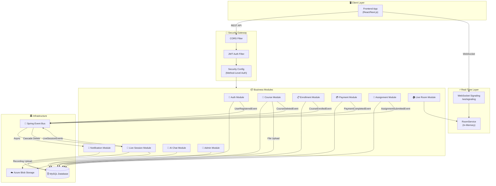
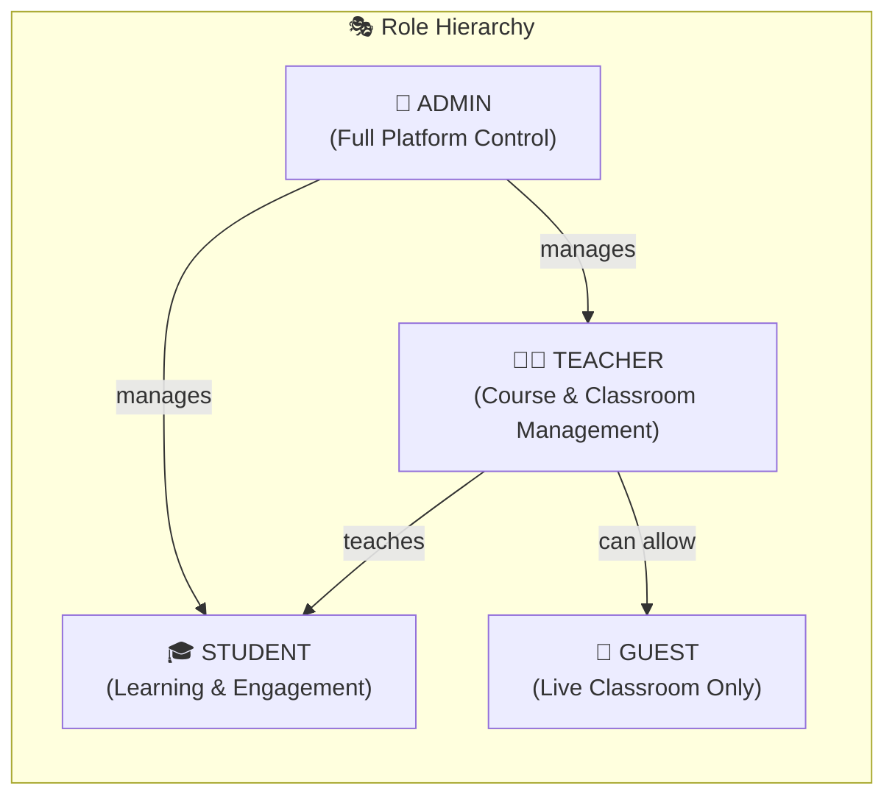
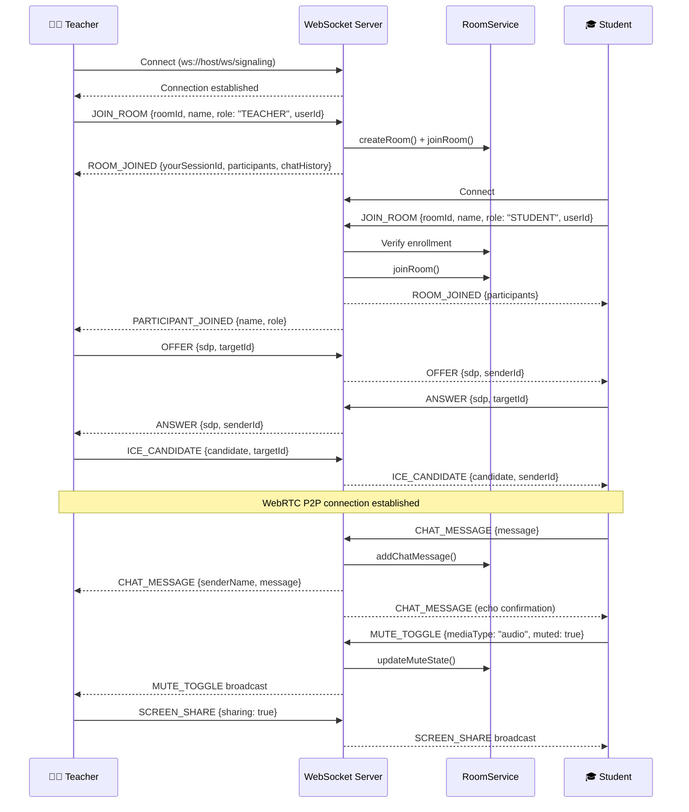
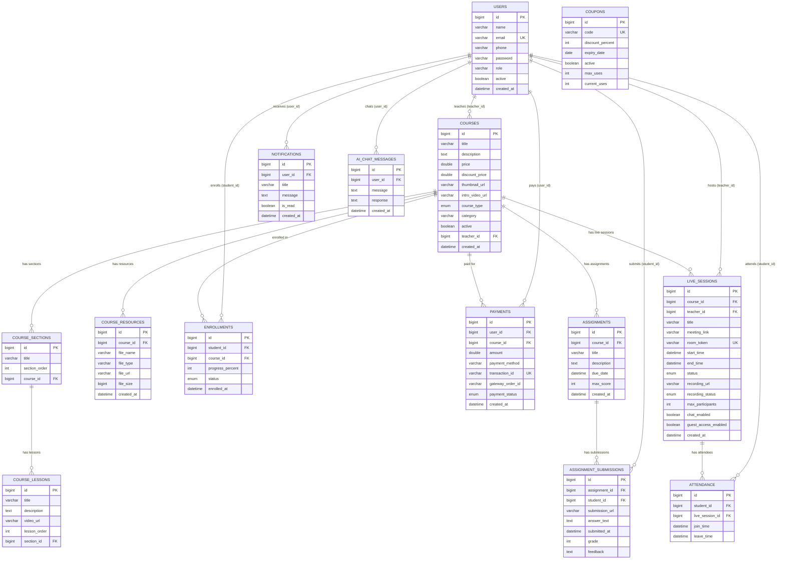
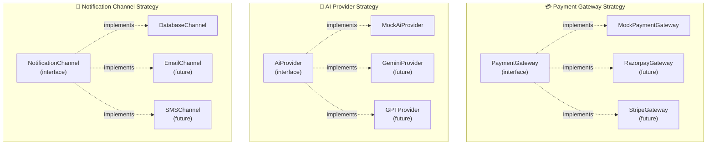
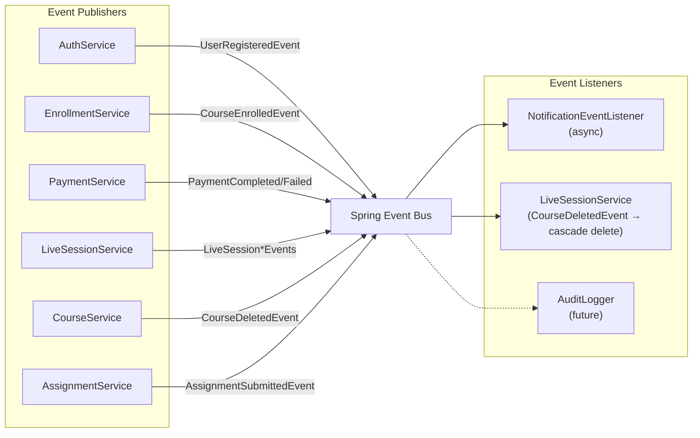
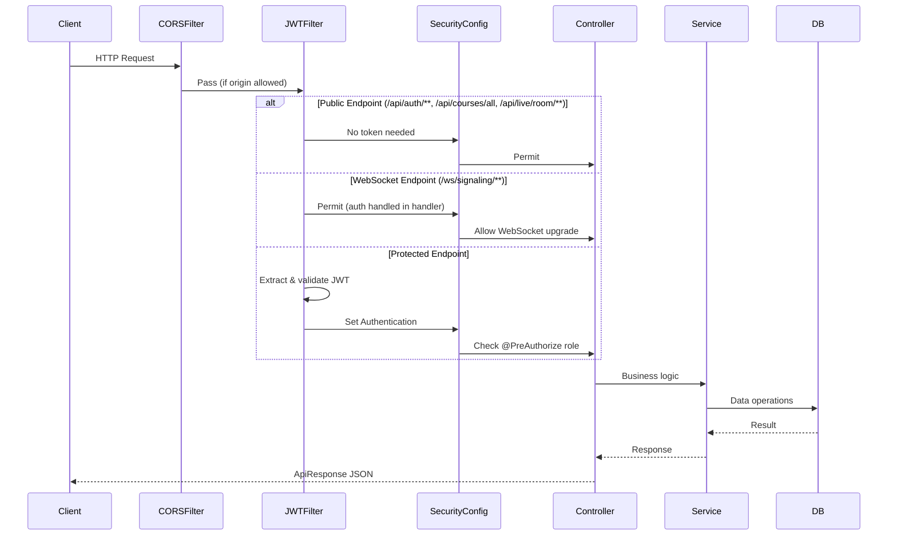
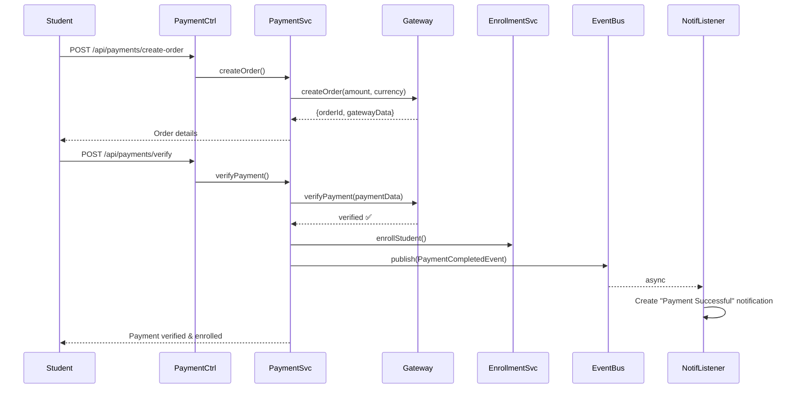
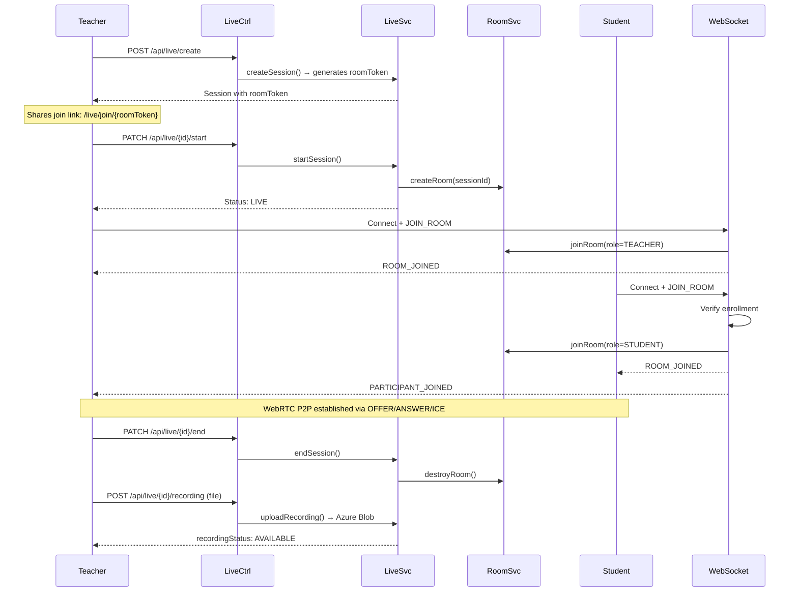
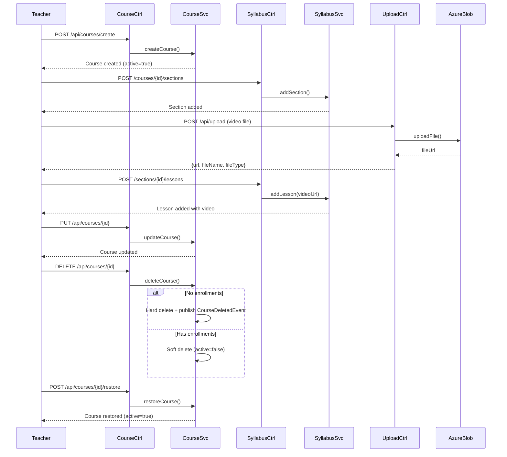

# 📚 LMS Backend — Learning Management System

> A production-grade, modular **Learning Management System** backend built with **Spring Boot 4.0**, featuring JWT authentication, role-based access control, event-driven notifications, **WebRTC live classrooms with WebSocket signaling**, pluggable payment gateways, AI-powered chat, and Azure Blob Storage integration.

---

## 📑 Table of Contents

- [Architecture Overview](#-architecture-overview)
- [High-Level System Architecture](#-high-level-system-architecture)
- [Technology Stack](#-technology-stack)
- [Module Architecture](#-module-architecture)
- [Features](#-features)
- [Roles & Permissions](#-roles--permissions)
- [API Endpoints & Interactions](#-api-endpoints--interactions)
- [WebSocket Protocol](#-websocket-protocol)
- [Database Schema](#-database-schema)
- [Entity Relationship Diagram](#-entity-relationship-diagram)
- [Design Patterns](#-design-patterns)
- [Event-Driven Architecture](#-event-driven-architecture)
- [Security Architecture](#-security-architecture)
- [Configuration](#-configuration)
- [Getting Started](#-getting-started)
- [Default Credentials](#-default-credentials)

---

## 🏗 Architecture Overview

The project follows a **Modular Monolith** architecture with clear separation of concerns. Each business domain (auth, course, payment, assignment, live sessions, notifications, AI) is organized as an independent module with its own controller, service, repository, DTO, and entity layers.

```
┌─────────────────────────────────────────────────────────────────────┐
│                        CLIENT (Frontend)                            │
│                  React / Next.js (Port 5173/3000)                   │
└──────────┬───────────────────────────────────────┬──────────────────┘
           │ HTTP/REST (JSON)                      │ WebSocket (ws://)
           ▼                                       ▼
┌─────────────────────────────────────────────────────────────────────┐
│                    SPRING BOOT APPLICATION                          │
│                       (Port 8080)                                   │
│  ┌───────────────────────────────────────────────────────────────┐  │
│  │                   SECURITY LAYER                              │  │
│  │  CORS Filter → JWT Filter → Security Config → Method Auth     │  │
│  └───────────────────────────────────────────────────────────────┘  │
│  ┌───────────────────────────────────────────────────────────────┐  │
│  │                   CONTROLLER LAYER                            │  │
│  │  AuthCtrl │ CourseCtrl │ PaymentCtrl │ LiveCtrl │ AdminCtrl   │  │
│  │  EnrollCtrl │ AssignmentCtrl │ NotifCtrl │ AiChatCtrl        │  │
│  │  LiveRoomCtrl │ SyllabusCtrl │ UploadCtrl                    │  │
│  └───────────────────────────────────────────────────────────────┘  │
│  ┌───────────────────────────────────────────────────────────────┐  │
│  │                    SERVICE LAYER                              │  │
│  │  Business logic, validation, event publishing                 │  │
│  └───────────────────────────────────────────────────────────────┘  │
│  ┌───────────────────────────────────────────────────────────────┐  │
│  │              WEBSOCKET LAYER (Live Classroom)                 │  │
│  │  SignalingWebSocketHandler → RoomService → RoomTokenService   │  │
│  └───────────────────────────────────────────────────────────────┘  │
│  ┌───────────────────────────────────────────────────────────────┐  │
│  │               REPOSITORY LAYER (Spring Data JPA)              │  │
│  └───────────────────────────────────────────────────────────────┘  │
│  ┌───────────────────────────────────────────────────────────────┐  │
│  │        CROSS-CUTTING: Events │ Strategies │ Exceptions        │  │
│  └───────────────────────────────────────────────────────────────┘  │
└──────────────────────────────┬──────────────────────────────────────┘
                               │
              ┌────────────────┼────────────────┐
              ▼                ▼                ▼
     ┌──────────────┐ ┌──────────────┐ ┌──────────────────┐
     │    MySQL      │ │ Azure Blob   │ │  AI Provider     │
     │   Database    │ │   Storage    │ │  (Pluggable)     │
     └──────────────┘ └──────────────┘ └──────────────────┘
```

---

## 🔰 High-Level System Architecture



---

## 🛠 Technology Stack

| Layer            | Technology                                |
|:-----------------|:------------------------------------------|
| **Framework**    | Spring Boot 4.0.6                         |
| **Language**     | Java 21                                   |
| **Build Tool**   | Maven                                     |
| **Database**     | MySQL with Hibernate ORM                  |
| **Security**     | Spring Security + JWT (jjwt 0.11.5)       |
| **Validation**   | Spring Boot Starter Validation            |
| **WebSocket**    | Spring Boot Starter WebSocket             |
| **File Storage** | Azure Blob Storage SDK 12.26.0            |
| **Code Gen**     | Lombok                                    |
| **API Style**    | RESTful with universal `ApiResponse<T>` envelope |
| **Real-Time**    | WebSocket + WebRTC signaling              |
| **Async**        | Spring `@Async` + custom `TaskExecutor`   |

---

## 📦 Module Architecture

The source code follows a clean modular package structure:

```
src/main/java/com/lms/
├── LmsApplication.java                    # Spring Boot entry point
│
├── common/                                # Shared cross-cutting code
│   ├── dto/
│   │   └── ApiResponse.java              # Universal API response wrapper
│   ├── enums/
│   │   ├── Role.java                     # ADMIN, TEACHER, STUDENT
│   │   ├── CourseType.java               # FREE, PAID
│   │   ├── EnrollmentStatus.java         # ACTIVE, COMPLETED, DROPPED
│   │   ├── PaymentStatus.java            # PENDING, SUCCESS, FAILED, REFUNDED
│   │   ├── SessionStatus.java            # SCHEDULED, LIVE, ENDED
│   │   ├── RecordingStatus.java          # NONE, RECORDING, PROCESSING, AVAILABLE, DELETED
│   │   └── RoleConverter.java            # JPA converter for Role enum
│   ├── event/
│   │   └── DomainEvents.java             # All domain event records
│   ├── exception/
│   │   └── GlobalExceptionHandler.java   # Centralized error handling
│   └── strategy/                          # Strategy pattern interfaces
│       ├── AiProvider.java               # Pluggable AI backends
│       ├── NotificationChannel.java      # Pluggable notification channels
│       └── PaymentGateway.java           # Pluggable payment gateways
│
├── config/
│   ├── AsyncConfig.java                  # Thread pool for @Async events
│   ├── AzureStorageConfig.java           # Azure Blob client bean
│   ├── CorsConfig.java                   # CORS origin whitelist
│   ├── DataSeeder.java                   # Seeds default Admin/Teacher/Student
│   └── WebSocketConfig.java              # WebSocket endpoint registration (/ws/signaling)
│
├── security/
│   ├── SecurityConfig.java               # HTTP security, filter chain, WebSocket permits
│   ├── JwtUtil.java                      # Token generation & validation
│   ├── JwtRequestFilter.java            # Intercepts every request for JWT
│   └── CustomUserDetailsService.java     # Loads user by email for auth
│
└── modules/
    ├── auth/                              # 🔑 Authentication Module
    │   ├── controller/AuthController.java  # register, login, /me profile
    │   ├── service/AuthService.java
    │   └── dto/ (LoginRequest, RegisterRequest, AuthResponse)
    │
    ├── user/                              # 👤 User & Admin Module
    │   ├── controller/AdminController.java
    │   ├── service/AdminService.java
    │   ├── entity/UserEntity.java
    │   ├── repository/UserRepository.java
    │   └── dto/ (AdminUserDetailResponse, AnalyticsResponse, MonthlyRevenueStats)
    │
    ├── course/                            # 📖 Course Management Module
    │   ├── controller/
    │   │   ├── CourseController.java       # CRUD + soft-delete + restore
    │   │   ├── EnrollmentController.java
    │   │   ├── SyllabusController.java
    │   │   └── UploadController.java
    │   ├── service/
    │   │   ├── CourseService.java          # Hard/soft delete, restore
    │   │   ├── EnrollmentService.java
    │   │   ├── SyllabusService.java
    │   │   └── AzureBlobStorageService.java
    │   ├── entity/ (Course, Section, Lesson, Enrollment, CourseResource)
    │   ├── repository/ (5 repositories)
    │   └── dto/ (CourseRequest/Response, SectionRequest, LessonRequest, etc.)
    │
    ├── assignment/                        # 📝 Assignment Module
    │   ├── controller/AssignmentController.java
    │   ├── service/AssignmentService.java
    │   ├── entity/ (Assignment, AssignmentSubmission)
    │   ├── repository/ (AssignmentRepository, SubmissionRepository)
    │   └── dto/ (AssignmentRequest, SubmissionRequest)
    │
    ├── payment/                           # 💳 Payment Module
    │   ├── controller/PaymentController.java
    │   ├── service/PaymentService.java
    │   ├── gateway/MockPaymentGateway.java
    │   ├── entity/ (Payment, Coupon)
    │   ├── repository/ (PaymentRepository, CouponRepository)
    │   └── dto/ (CreateOrderRequest, VerifyPaymentRequest, CouponRequest)
    │
    ├── live/                              # 🎥 Live Session & Classroom Module
    │   ├── controller/
    │   │   ├── LiveSessionController.java  # Session lifecycle + recording upload/delete
    │   │   └── LiveRoomController.java     # Room access via token, guest join, fallback
    │   ├── service/
    │   │   ├── LiveSessionService.java     # Session CRUD, recording management
    │   │   ├── RoomService.java            # In-memory room/participant/chat management
    │   │   └── RoomTokenService.java       # UUID-based shareable room tokens
    │   ├── websocket/
    │   │   └── SignalingWebSocketHandler.java  # WebRTC signaling (SDP, ICE, chat, mute)
    │   ├── entity/ (LiveSession, Attendance)
    │   ├── repository/ (LiveSessionRepository, AttendanceRepository)
    │   └── dto/LiveSessionRequest.java
    │
    ├── notification/                      # 🔔 Notification Module
    │   ├── controller/NotificationController.java
    │   ├── service/NotificationService.java
    │   ├── listener/NotificationEventListener.java
    │   ├── entity/NotificationEntity.java
    │   └── repository/NotificationRepository.java
    │
    └── ai/                                # 🤖 AI Chat Module
        ├── controller/AiChatController.java
        ├── service/AiChatService.java
        ├── provider/MockAiProvider.java
        ├── entity/AiChatMessageEntity.java
        ├── repository/AiChatMessageRepository.java
        └── dto/AiChatRequest.java
```

---

## ✨ Features

### 🔑 Authentication & Authorization
- User registration with role selection (Students auto-activate; Admin creates Teachers)
- Login with JWT token generation (24-hour expiration)
- **`/api/auth/me` endpoint** — Fetch current user profile from JWT token (returns id, name, role, email)
- **Auth response includes `userId`** — Frontend receives userId alongside token, name, and role on login
- BCrypt password hashing
- Method-level authorization via `@PreAuthorize`
- Stateless session management (no server-side sessions)

### 📖 Course Management
- Full CRUD for courses with category tagging
- **Course update** — Teachers/Admins can edit existing courses
- **Soft-delete & hard-delete** — Courses with enrollments are soft-deleted (archived); empty courses are hard-deleted
- **Course restore** — Archived courses can be reactivated
- **Active flag** — Only active courses appear in public listings
- Course types: **FREE** and **PAID**
- Hierarchical syllabus structure: **Course → Sections → Lessons**
- Course resources (PDF, DOC, ZIP, VIDEO) linked to courses
- **Cascade deletion** — Deleting a course publishes `CourseDeletedEvent`, which auto-deletes associated live sessions and attendance records
- File uploads up to **500MB** via Azure Blob Storage
- Public course browsing (no auth required)
- Search by keyword and filter by category
- Teacher-specific course listing

### 📋 Enrollment System
- Student self-enrollment for free courses
- Payment-gated enrollment for paid courses
- Progress tracking with percentage completion
- Enrollment status lifecycle: `ACTIVE → COMPLETED / DROPPED`
- Unique constraint preventing duplicate enrollments
- Admin manual enrollment and revocation

### 💳 Payment & Coupon System
- Two-phase payment flow: **Create Order → Verify Payment**
- Pluggable payment gateways via **Strategy Pattern**
- Mock gateway included for development/testing
- Automatic enrollment on successful payment verification
- Coupon/discount code system with:
  - Percentage-based discounts
  - Expiry dates
  - Usage limits (max uses / current uses tracking)
- Complete payment history per user
- Admin can manage all transactions

### 📝 Assignments & Grading
- Teachers create assignments per course with due dates and max scores
- Students submit answers (text or URL-based file submissions)
- Teachers grade submissions with score and textual feedback
- One submission per student per assignment (unique constraint)

### 🎥 Live Classroom System (WebRTC + WebSocket)

The live classroom is a full-featured **real-time video conferencing** system with:

#### Session Management
- Schedule, start, end, reschedule, and cancel live sessions
- Session status lifecycle: `SCHEDULED → LIVE → ENDED`
- **Room tokens** — Each session gets a unique UUID-based shareable join link
- **Configurable settings** per session:
  - `maxParticipants` (default: 50)
  - `chatEnabled` (default: true)
  - `guestAccessEnabled` (default: true)

#### WebRTC Signaling (WebSocket at `/ws/signaling`)
- **Full WebRTC negotiation** — SDP offers/answers, ICE candidate exchange
- **Peer-to-peer video/audio** connection establishment
- **Screen sharing** support via broadcast messages
- **JSON-based message protocol** with types: `JOIN_ROOM`, `LEAVE_ROOM`, `OFFER`, `ANSWER`, `ICE_CANDIDATE`, `CHAT_MESSAGE`, `MUTE_TOGGLE`, `SCREEN_SHARE`

#### In-Memory Room Management (`RoomService`)
- Thread-safe room state via `ConcurrentHashMap`
- Real-time participant tracking (join/leave with WebSocket session IDs)
- **Audio/video mute state** synchronization across all participants
- **Live chat** with message history (capped at 500 messages per room)
- Participant list broadcast on join/leave events
- Room auto-creation when teacher starts a session
- Room cleanup on session end

#### Guest Access & Room Tokens
- **Public room info endpoint** (`/api/live/room/{roomToken}`) — Pre-join lobby data
- **Guest join** (`/api/live/room/{roomToken}/guest-join`) — No auth required when guest access is enabled
- **Enrollment-gated access** — Students must be enrolled in the course (when guest access is disabled)
- **Fallback endpoint** (`/api/live/room/token-bypass-fallback/{sessionId}`) — Direct session ID access

#### Recording Management
- **Upload recordings** to Azure Blob Storage per session
- Recording status lifecycle: `NONE → RECORDING → PROCESSING → AVAILABLE → DELETED`
- Teachers can upload and delete recordings for their sessions

#### Attendance Tracking
- Student join/leave tracking with timestamps
- Attendance records per session

### 🔔 Real-Time Notification System
- **Event-driven architecture** using Spring Application Events
- Async notification processing on background threads
- Automatic notifications for:
  - Welcome on registration
  - Enrollment confirmation
  - Payment success/failure
  - Live session scheduled/rescheduled/started/cancelled
- Unread count API for badge display
- Mark individual or all notifications as read

### 🤖 AI-Powered Chat
- Pluggable AI provider via **Strategy Pattern**
- Chat history persistence per user
- Mock provider included for development
- Extensible to Gemini, Claude, GPT, or any custom LLM

### 👑 Admin Dashboard APIs
- Platform-wide analytics (students, teachers, courses, enrollments, revenue)
- Monthly revenue statistics
- Full user management (list, details, activate/deactivate, delete)
- Teacher registration
- Manual enrollment and revocation
- Coupon CRUD management
- Transaction history overview

---

## 🎭 Roles & Permissions

The system implements **three distinct roles**, each with carefully scoped permissions. Live classrooms additionally support a **GUEST** role for unauthenticated participants.



### 👑 ADMIN — Platform Administrator

| Area | Permissions |
|:-----|:------------|
| **Users** | List all users, view details, toggle active/inactive, delete users, register teachers |
| **Courses** | View all courses with enrollment counts, full course CRUD, soft-delete, restore |
| **Enrollments** | View all enrollments, manually enroll students, revoke enrollments |
| **Payments** | View all transactions, revenue analytics |
| **Coupons** | Create, update, delete discount coupons |
| **Analytics** | View total students, teachers, courses, enrollments, total/monthly/yearly revenue |
| **Content** | Create/edit sections, lessons, and resources |
| **Live Sessions** | Create, start, end, update, delete sessions, upload/delete recordings |
| **Assignments** | Create assignments, view and grade submissions |

### 🧑‍🏫 TEACHER — Instructor

| Area | Permissions |
|:-----|:------------|
| **Courses** | Create, update, delete (soft/hard), restore courses, view own courses |
| **Syllabus** | Add/edit/delete sections and lessons within own courses |
| **Resources** | Upload and manage course resources (up to 500MB) |
| **Assignments** | Create assignments, view submissions, grade with feedback |
| **Live Sessions** | Schedule, start, end, update, delete live sessions |
| **Live Classroom** | Configure max participants, chat, guest access per session |
| **Recordings** | Upload and delete session recordings |
| **Notifications** | View and manage own notifications |
| **AI Chat** | Use AI chat assistant |

### 🎓 STUDENT — Learner

| Area | Permissions |
|:-----|:------------|
| **Courses** | Browse all active courses (public), search, filter by category |
| **Enrollment** | Self-enroll in free courses, check enrollment status |
| **Payments** | Create payment orders, verify payments (auto-enrolls on success) |
| **Progress** | Update course completion percentage |
| **Syllabus** | View sections, lessons, and resources (enrolled courses only) |
| **Assignments** | Submit assignments for enrolled courses |
| **Live Sessions** | Join/leave live sessions, view sessions for enrolled courses |
| **Live Classroom** | Join via room token (enrollment validated), chat, screen view |
| **Notifications** | View notifications, unread count, mark as read |
| **AI Chat** | Use AI chat assistant |

### 👤 GUEST — Unauthenticated Viewer (Live Classroom Only)

| Area | Permissions |
|:-----|:------------|
| **Live Classroom** | Join via room token (only if guest access enabled), chat, view stream |
| **Restrictions** | No enrollment, no assignments, no payment, no course content access |

---

## 🔄 API Endpoints & Interactions

### Authentication (`/api/auth`)

| Method | Endpoint | Auth | Role | Description |
|:------:|:---------|:----:|:----:|:------------|
| `POST` | `/register` | ❌ | Any | Register a new student (auto-activated) |
| `POST` | `/login` | ❌ | Any | Login & receive JWT + userId + role |
| `GET` | `/me` | ✅ | Any auth | Get current user profile from JWT |

### Courses (`/api/courses`)

| Method | Endpoint | Auth | Role | Description |
|:------:|:---------|:----:|:----:|:------------|
| `POST` | `/create` | ✅ | TEACHER, ADMIN | Create a new course |
| `GET` | `/all` | ❌ | Public | List all active courses |
| `GET` | `/{id}` | ❌ | Public | Get course details |
| `GET` | `/search?keyword=` | ❌ | Public | Search active courses |
| `GET` | `/category/{category}` | ❌ | Public | Filter active courses by category |
| `GET` | `/my-courses` | ✅ | TEACHER, ADMIN | Get teacher's courses |
| `PUT` | `/{id}` | ✅ | TEACHER, ADMIN | Update course |
| `DELETE` | `/{id}` | ✅ | TEACHER, ADMIN | Soft-delete (if enrolled) or hard-delete |
| `POST` | `/{id}/restore` | ✅ | TEACHER, ADMIN | Restore archived course |

### Syllabus (`/api`)

| Method | Endpoint | Auth | Role | Description |
|:------:|:---------|:----:|:----:|:------------|
| `POST` | `/courses/{courseId}/sections` | ✅ | TEACHER, ADMIN | Add section |
| `GET` | `/courses/{courseId}/sections` | ✅ | Enrolled | Get sections |
| `PUT` | `/sections/{id}` | ✅ | TEACHER, ADMIN | Update section |
| `DELETE` | `/sections/{id}` | ✅ | TEACHER, ADMIN | Delete section |
| `POST` | `/sections/{sectionId}/lessons` | ✅ | TEACHER, ADMIN | Add lesson |
| `GET` | `/sections/{sectionId}/lessons` | ✅ | Enrolled | Get lessons |
| `PUT` | `/lessons/{id}` | ✅ | TEACHER, ADMIN | Update lesson |
| `DELETE` | `/lessons/{id}` | ✅ | TEACHER, ADMIN | Delete lesson |
| `POST` | `/courses/{courseId}/resources` | ✅ | TEACHER, ADMIN | Add resource |
| `GET` | `/courses/{courseId}/resources` | ✅ | Enrolled | Get resources |
| `PUT` | `/resources/{id}` | ✅ | TEACHER, ADMIN | Update resource |
| `DELETE` | `/resources/{id}` | ✅ | TEACHER, ADMIN | Delete resource |

### File Upload (`/api/upload`)

| Method | Endpoint | Auth | Role | Description |
|:------:|:---------|:----:|:----:|:------------|
| `POST` | `/` | ✅ | TEACHER, ADMIN | Upload file to Azure Blob Storage |

### Enrollments (`/api/enrollments`)

| Method | Endpoint | Auth | Role | Description |
|:------:|:---------|:----:|:----:|:------------|
| `POST` | `/enroll/{courseId}` | ✅ | STUDENT | Enroll in a free course |
| `GET` | `/my-courses` | ✅ | STUDENT | List enrolled courses |
| `PATCH` | `/progress/{courseId}?percent=` | ✅ | STUDENT | Update progress |
| `GET` | `/check/{courseId}` | ✅ | Any auth | Check enrollment status |

### Payments (`/api/payments`)

| Method | Endpoint | Auth | Role | Description |
|:------:|:---------|:----:|:----:|:------------|
| `POST` | `/create-order` | ✅ | STUDENT | Create payment order |
| `POST` | `/verify` | ✅ | STUDENT | Verify payment & auto-enroll |
| `GET` | `/my-payments` | ✅ | Any auth | Get payment history |

### Assignments (`/api/assignments`)

| Method | Endpoint | Auth | Role | Description |
|:------:|:---------|:----:|:----:|:------------|
| `POST` | `/create` | ✅ | TEACHER, ADMIN | Create assignment |
| `GET` | `/course/{courseId}` | ✅ | Any auth | Get course assignments |
| `POST` | `/submit` | ✅ | STUDENT | Submit assignment |
| `GET` | `/{assignmentId}/submissions` | ✅ | TEACHER, ADMIN | View submissions |
| `PATCH` | `/submissions/{id}/grade` | ✅ | TEACHER, ADMIN | Grade submission |

### Live Sessions (`/api/live`)

| Method | Endpoint | Auth | Role | Description |
|:------:|:---------|:----:|:----:|:------------|
| `POST` | `/create` | ✅ | TEACHER, ADMIN | Schedule a session (generates room token) |
| `PATCH` | `/{id}/start` | ✅ | TEACHER, ADMIN | Start session (creates in-memory room) |
| `PATCH` | `/{id}/end` | ✅ | TEACHER, ADMIN | End session (destroys room) |
| `POST` | `/{id}/join` | ✅ | STUDENT | Join live session (validates enrollment) |
| `POST` | `/{id}/leave` | ✅ | STUDENT | Leave live session |
| `GET` | `/course/{courseId}` | ✅ | Any auth | Sessions by course |
| `GET` | `/enrolled` | ✅ | STUDENT | Sessions for enrolled courses |
| `GET` | `/my-sessions` | ✅ | TEACHER, ADMIN | Teacher's sessions |
| `GET` | `/{id}/attendance` | ✅ | TEACHER, ADMIN | Session attendance |
| `PUT` | `/{id}` | ✅ | TEACHER, ADMIN | Update session settings |
| `DELETE` | `/{id}` | ✅ | TEACHER, ADMIN | Delete/cancel session |
| `POST` | `/{id}/recording` | ✅ | TEACHER, ADMIN | Upload recording (multipart file) |
| `DELETE` | `/{id}/recording` | ✅ | TEACHER, ADMIN | Delete recording |

### Live Room (`/api/live/room`) — Shareable Link Access

| Method | Endpoint | Auth | Role | Description |
|:------:|:---------|:----:|:----:|:------------|
| `GET` | `/{roomToken}` | ❌* | Any | Get room info by shareable token (pre-join lobby) |
| `POST` | `/{roomToken}/guest-join` | ❌ | Guest | Guest join (requires guest access enabled) |
| `GET` | `/token-bypass-fallback/{sessionId}` | ❌* | Any | Fallback room info by session ID |

> \* These endpoints are publicly accessible but enforce enrollment checks when guest access is disabled.

### Notifications (`/api/notifications`)

| Method | Endpoint | Auth | Role | Description |
|:------:|:---------|:----:|:----:|:------------|
| `GET` | `/` | ✅ | Any auth | Get user notifications |
| `GET` | `/unread-count` | ✅ | Any auth | Get unread count |
| `PATCH` | `/{id}/read` | ✅ | Any auth | Mark as read |
| `PATCH` | `/read-all` | ✅ | Any auth | Mark all as read |

### AI Chat (`/api/ai`)

| Method | Endpoint | Auth | Role | Description |
|:------:|:---------|:----:|:----:|:------------|
| `POST` | `/chat?provider=mock` | ✅ | Any auth | Send message to AI |
| `GET` | `/history` | ✅ | Any auth | Get chat history |

### Admin (`/api/admin`) — All require `ADMIN` role

| Method | Endpoint | Description |
|:------:|:---------|:------------|
| `GET` | `/users` | List all users |
| `GET` | `/users/{id}` | User detail with enrollments/payments |
| `PATCH` | `/users/{id}/toggle-active` | Activate/deactivate user |
| `DELETE` | `/users/{id}` | Delete user |
| `POST` | `/users/register-teacher` | Register a new teacher |
| `GET` | `/analytics` | Platform-wide analytics |
| `GET` | `/courses` | All courses with enrollment counts |
| `GET` | `/enrollments` | All enrollments |
| `POST` | `/enrollments` | Manual enrollment |
| `DELETE` | `/enrollments/{id}` | Revoke enrollment |
| `GET` | `/transactions` | All payment transactions |
| `GET` | `/coupons` | List coupons |
| `POST` | `/coupons` | Create coupon |
| `PUT` | `/coupons/{id}` | Update coupon |
| `DELETE` | `/coupons/{id}` | Delete coupon |

---

## 📡 WebSocket Protocol

The live classroom uses a JSON-based WebSocket signaling protocol at `ws://localhost:8080/ws/signaling`.

### Connection Flow



### Message Types

| Type | Direction | Description |
|:-----|:----------|:------------|
| `JOIN_ROOM` | Client → Server | Join a live classroom room |
| `LEAVE_ROOM` | Client → Server | Leave the room |
| `ROOM_JOINED` | Server → Client | Room state sent to joining participant |
| `PARTICIPANT_JOINED` | Server → Others | New participant notification |
| `PARTICIPANT_LEFT` | Server → Others | Participant departure notification |
| `OFFER` | Client → Client (via Server) | WebRTC SDP offer (peer-to-peer or broadcast) |
| `ANSWER` | Client → Client (via Server) | WebRTC SDP answer (targeted) |
| `ICE_CANDIDATE` | Client → Client (via Server) | WebRTC ICE candidate (targeted or broadcast) |
| `CHAT_MESSAGE` | Client ↔ Server | Send/receive chat messages |
| `MUTE_TOGGLE` | Client ↔ Server | Audio/video mute state synchronization |
| `SCREEN_SHARE` | Client ↔ Server | Screen sharing state broadcast |
| `ERROR` | Server → Client | Error notification |

### Message Format

```json
{
  "type": "JOIN_ROOM",
  "roomId": 42,
  "payload": {
    "name": "John Doe",
    "role": "STUDENT",
    "userId": 15,
    "audioMuted": true,
    "videoMuted": false
  }
}
```

---

## 🗃 Database Schema

The system uses **12 database tables** with carefully designed indexes and constraints:

### Table Details

#### `users`
| Column | Type | Constraints |
|:-------|:-----|:------------|
| `id` | BIGINT | PK, AUTO_INCREMENT |
| `name` | VARCHAR(255) | NOT NULL |
| `email` | VARCHAR(255) | NOT NULL, UNIQUE |
| `phone` | VARCHAR(255) | NOT NULL |
| `password` | VARCHAR(255) | NOT NULL (BCrypt hashed) |
| `role` | VARCHAR(255) | NOT NULL (ADMIN/TEACHER/STUDENT) |
| `active` | BOOLEAN | NOT NULL, DEFAULT false |
| `created_at` | DATETIME | Auto-set on create |
> **Indexes:** `idx_user_email`, `idx_user_role`

---

#### `courses`
| Column | Type | Constraints |
|:-------|:-----|:------------|
| `id` | BIGINT | PK, AUTO_INCREMENT |
| `title` | VARCHAR(255) | NOT NULL |
| `description` | TEXT | |
| `price` | DOUBLE | NOT NULL |
| `discount_price` | DOUBLE | |
| `thumbnail_url` | VARCHAR(255) | |
| `intro_video_url` | VARCHAR(255) | |
| `course_type` | ENUM | NOT NULL (FREE/PAID) |
| `category` | VARCHAR(100) | |
| `active` | BOOLEAN | NOT NULL, DEFAULT true |
| `teacher_id` | BIGINT | FK → users.id, NOT NULL |
| `created_at` | DATETIME | Auto-set on create |
> **Indexes:** `idx_course_teacher`, `idx_course_type`, `idx_course_category`  
> **Note:** Courses have `active` flag for soft-delete/archiving. Only active courses appear in public listings.

---

#### `course_sections`
| Column | Type | Constraints |
|:-------|:-----|:------------|
| `id` | BIGINT | PK, AUTO_INCREMENT |
| `title` | VARCHAR(255) | NOT NULL |
| `section_order` | INT | NOT NULL |
| `course_id` | BIGINT | FK → courses.id, NOT NULL |

---

#### `course_lessons`
| Column | Type | Constraints |
|:-------|:-----|:------------|
| `id` | BIGINT | PK, AUTO_INCREMENT |
| `title` | VARCHAR(255) | NOT NULL |
| `description` | TEXT | |
| `video_url` | VARCHAR(255) | |
| `lesson_order` | INT | NOT NULL |
| `section_id` | BIGINT | FK → course_sections.id, NOT NULL |

---

#### `course_resources`
| Column | Type | Constraints |
|:-------|:-----|:------------|
| `id` | BIGINT | PK, AUTO_INCREMENT |
| `course_id` | BIGINT | FK → courses.id, NOT NULL |
| `file_name` | VARCHAR(255) | NOT NULL |
| `file_type` | VARCHAR(20) | (PDF/DOC/ZIP/VIDEO) |
| `file_url` | VARCHAR(255) | NOT NULL |
| `file_size` | BIGINT | In bytes |
| `created_at` | DATETIME | Auto-set on create |
> **Indexes:** `idx_resource_course`

---

#### `enrollments`
| Column | Type | Constraints |
|:-------|:-----|:------------|
| `id` | BIGINT | PK, AUTO_INCREMENT |
| `student_id` | BIGINT | FK → users.id, NOT NULL |
| `course_id` | BIGINT | FK → courses.id, NOT NULL |
| `progress_percent` | INT | NOT NULL, DEFAULT 0 |
| `status` | ENUM | NOT NULL (ACTIVE/COMPLETED/DROPPED) |
| `enrolled_at` | DATETIME | Auto-set on create |
> **Unique Constraint:** `(student_id, course_id)` — prevents duplicate enrollments  
> **Indexes:** `idx_enrollment_student`, `idx_enrollment_course`

---

#### `payments`
| Column | Type | Constraints |
|:-------|:-----|:------------|
| `id` | BIGINT | PK, AUTO_INCREMENT |
| `user_id` | BIGINT | FK → users.id, NOT NULL |
| `course_id` | BIGINT | FK → courses.id, NOT NULL |
| `amount` | DOUBLE | NOT NULL |
| `payment_method` | VARCHAR(50) | |
| `transaction_id` | VARCHAR(255) | UNIQUE |
| `gateway_order_id` | VARCHAR(255) | |
| `payment_status` | ENUM | NOT NULL (PENDING/SUCCESS/FAILED/REFUNDED) |
| `created_at` | DATETIME | Auto-set on create |
> **Indexes:** `idx_payment_user`, `idx_payment_course`, `idx_payment_txn`

---

#### `coupons`
| Column | Type | Constraints |
|:-------|:-----|:------------|
| `id` | BIGINT | PK, AUTO_INCREMENT |
| `code` | VARCHAR(50) | NOT NULL, UNIQUE |
| `discount_percent` | INT | NOT NULL |
| `expiry_date` | DATE | |
| `active` | BOOLEAN | NOT NULL, DEFAULT true |
| `max_uses` | INT | |
| `current_uses` | INT | NOT NULL, DEFAULT 0 |
> **Indexes:** `idx_coupon_code`

---

#### `assignments`
| Column | Type | Constraints |
|:-------|:-----|:------------|
| `id` | BIGINT | PK, AUTO_INCREMENT |
| `course_id` | BIGINT | FK → courses.id, NOT NULL |
| `title` | VARCHAR(255) | NOT NULL |
| `description` | TEXT | |
| `due_date` | DATETIME | |
| `max_score` | INT | DEFAULT 100 |
| `created_at` | DATETIME | Auto-set on create |
> **Indexes:** `idx_assignment_course`

---

#### `assignment_submissions`
| Column | Type | Constraints |
|:-------|:-----|:------------|
| `id` | BIGINT | PK, AUTO_INCREMENT |
| `assignment_id` | BIGINT | FK → assignments.id, NOT NULL |
| `student_id` | BIGINT | FK → users.id, NOT NULL |
| `submission_url` | VARCHAR(255) | |
| `answer_text` | TEXT | |
| `submitted_at` | DATETIME | Auto-set on create |
| `grade` | INT | |
| `feedback` | TEXT | |
> **Unique Constraint:** `(assignment_id, student_id)` — one submission per student  
> **Indexes:** `idx_submission_assignment`, `idx_submission_student`

---

#### `live_sessions`
| Column | Type | Constraints |
|:-------|:-----|:------------|
| `id` | BIGINT | PK, AUTO_INCREMENT |
| `course_id` | BIGINT | FK → courses.id, NOT NULL |
| `teacher_id` | BIGINT | FK → users.id, NOT NULL |
| `title` | VARCHAR(255) | NOT NULL |
| `meeting_link` | VARCHAR(255) | |
| `room_token` | VARCHAR(255) | UNIQUE (UUID for shareable join links) |
| `start_time` | DATETIME | NOT NULL |
| `end_time` | DATETIME | |
| `status` | ENUM | NOT NULL (SCHEDULED/LIVE/ENDED) |
| `recording_url` | VARCHAR(1024) | |
| `recording_status` | ENUM | NOT NULL (NONE/RECORDING/PROCESSING/AVAILABLE/DELETED) |
| `max_participants` | INT | DEFAULT 50 |
| `chat_enabled` | BOOLEAN | DEFAULT true |
| `guest_access_enabled` | BOOLEAN | DEFAULT true |
| `created_at` | DATETIME | Auto-set on create |
> **Indexes:** `idx_live_course`, `idx_live_teacher`, `idx_live_status`, `idx_live_room_token` (unique)

---

#### `attendance`
| Column | Type | Constraints |
|:-------|:-----|:------------|
| `id` | BIGINT | PK, AUTO_INCREMENT |
| `student_id` | BIGINT | FK → users.id, NOT NULL |
| `live_session_id` | BIGINT | FK → live_sessions.id, NOT NULL |
| `join_time` | DATETIME | |
| `leave_time` | DATETIME | |
> **Indexes:** `idx_attendance_student`, `idx_attendance_session`

---

#### `notifications`
| Column | Type | Constraints |
|:-------|:-----|:------------|
| `id` | BIGINT | PK, AUTO_INCREMENT |
| `user_id` | BIGINT | FK → users.id, NOT NULL |
| `title` | VARCHAR(255) | NOT NULL |
| `message` | TEXT | NOT NULL |
| `is_read` | BOOLEAN | NOT NULL, DEFAULT false |
| `created_at` | DATETIME | Auto-set on create |
> **Indexes:** `idx_notification_user`, `idx_notification_read`

---

#### `ai_chat_messages`
| Column | Type | Constraints |
|:-------|:-----|:------------|
| `id` | BIGINT | PK, AUTO_INCREMENT |
| `user_id` | BIGINT | FK → users.id, NOT NULL |
| `message` | TEXT | NOT NULL |
| `response` | TEXT | NOT NULL |
| `created_at` | DATETIME | Auto-set on create |
> **Indexes:** `idx_ai_chat_user`

---

## 🔗 Entity Relationship Diagram



---

## 🎯 Design Patterns

The project implements several enterprise design patterns:

### 1. Strategy Pattern
Enables pluggable implementations without modifying existing code:



### 2. Observer Pattern (Event-Driven)
Domain events decouple services. Adding new reactions requires zero changes to existing code:



### 3. Repository Pattern
Spring Data JPA repositories abstract all database operations.

### 4. DTO Pattern
Request/Response DTOs prevent entity leakage and shape API contracts.

### 5. Factory Method
`ApiResponse.success()` and `ApiResponse.error()` static factory methods create consistent response wrappers.

### 6. Room Management Pattern
The `RoomService` uses an in-memory `ConcurrentHashMap` for thread-safe, real-time room state management with immutable `Participant` and `Room` records.

---

## 📡 Event-Driven Architecture

All domain events are defined as immutable Java **records** in `DomainEvents.java`:

| Event | Published By | Triggers |
|:------|:-------------|:---------|
| `UserRegisteredEvent` | AuthService | Welcome notification |
| `CourseCreatedEvent` | CourseService | — |
| `CourseDeletedEvent` | CourseService | **Cascade: deletes live sessions + attendance** |
| `CourseEnrolledEvent` | EnrollmentService | Enrollment confirmation |
| `PaymentCompletedEvent` | PaymentService | Payment success notification |
| `PaymentFailedEvent` | PaymentService | Payment failure alert |
| `LiveSessionScheduledEvent` | LiveSessionService | Notify enrolled students |
| `LiveSessionRescheduledEvent` | LiveSessionService | Notify enrolled students |
| `LiveSessionStartedEvent` | LiveSessionService | "Join now" notification |
| `LiveSessionCancelledEvent` | LiveSessionService | Cancellation notice |
| `LiveSessionEndedEvent` | LiveSessionService | — |
| `AssignmentSubmittedEvent` | AssignmentService | — |

> All notification listeners run `@Async` on a dedicated `taskExecutor` thread pool — HTTP responses return immediately without waiting for notifications.

---

## 🔐 Security Architecture



### Security Features
- **Stateless JWT** — No server-side sessions, horizontal scaling friendly
- **BCrypt** password hashing
- **Method-level security** with `@PreAuthorize` annotations
- **CORS whitelist** — Configurable allowed origins (applied to both REST and WebSocket)
- **Security Headers** — X-Frame-Options: DENY, XSS Protection, CSP
- **Public endpoints** — Course browsing, auth, live room access, and WebSocket signaling
- **WebSocket authorization** — `SignalingWebSocketHandler` validates enrollment/guest access at the application level
- **All other endpoints** require valid JWT
- **Student auto-activation** — Students are active immediately upon registration

### Public (Unauthenticated) Endpoints
```
/api/auth/**                    # Register, Login, /me
/api/courses/all                # Browse all active courses
/api/courses/{id}               # Course details
/api/courses/search             # Search courses
/api/courses/category/**        # Filter by category
/api/live/room/**               # Room info, guest join (with access checks)
/ws/signaling/**                # WebSocket signaling (auth in handler)
```

---

## ⚙ Configuration

All configuration is externalized via environment variables with sensible defaults:

| Property | Environment Variable | Default |
|:---------|:-------------------|:--------|
| Database URL | `SPRING_DATASOURCE_URL` | `jdbc:mysql://localhost:3306/lms` |
| Database Username | `SPRING_DATASOURCE_USERNAME` | `root` |
| Database Password | `SPRING_DATASOURCE_PASSWORD` | `root@123` |
| CORS Origins | `APP_CORS_ALLOWED_ORIGINS` | `http://localhost:5173,http://localhost:3000` |
| Azure Connection | `AZURE_STORAGE_CONNECTION_STRING` | — |
| Azure Container | `AZURE_STORAGE_CONTAINER_NAME` | `ranadjcontainer` |
| JWT Secret | `JWT_SECRET` | (dev-only key, 32+ chars required) |
| Server Port | — | `8080` |
| Max Upload Size | — | `500MB` |

---

## 🚀 Getting Started

### Prerequisites
- **Java 21** or higher
- **MySQL 8.0+** running on port 3306
- **Maven 3.9+** (or use the included `mvnw` wrapper)
- (Optional) Azure Storage account for file uploads

### Steps

```bash
# 1. Clone the repository
git clone <repo-url>
cd lms-backend

# 2. Create the MySQL database
mysql -u root -p -e "CREATE DATABASE lms;"

# 3. Configure environment (optional — defaults work for local dev)
export SPRING_DATASOURCE_PASSWORD=your_password
export JWT_SECRET=your_secret_key_at_least_32_characters

# 4. Build and run
./mvnw spring-boot:run

# The server starts at http://localhost:8080
# WebSocket signaling at ws://localhost:8080/ws/signaling
# Hibernate auto-creates all tables (ddl-auto=update)
# DataSeeder creates default users on first run
```

---

## 🔑 Default Credentials

The `DataSeeder` creates three default accounts on startup:

| Role | Email | Password |
|:-----|:------|:---------|
| 👑 Admin | `admin@lms.com` | `admin123` |
| 🧑‍🏫 Teacher | `teacher@lms.com` | `teacher123` |
| 🎓 Student | `student@lms.com` | `student123` |

> ⚠️ **Change these credentials in production!**

---

## 📄 API Response Format

Every endpoint returns a consistent JSON envelope:

```json
{
  "success": true,
  "message": "Description of result",
  "data": { }
}
```

Error responses follow the same shape:

```json
{
  "success": false,
  "message": "Error description",
  "data": null
}
```

---

## 📊 Interaction Flow Diagrams

### Student Course Purchase Flow



### Live Classroom Session Flow



### Teacher Course Management Flow



---

<p align="center">
  Built with ❤️ using Spring Boot 4.0 &bull; Java 21 &bull; MySQL &bull; WebSocket
</p>
